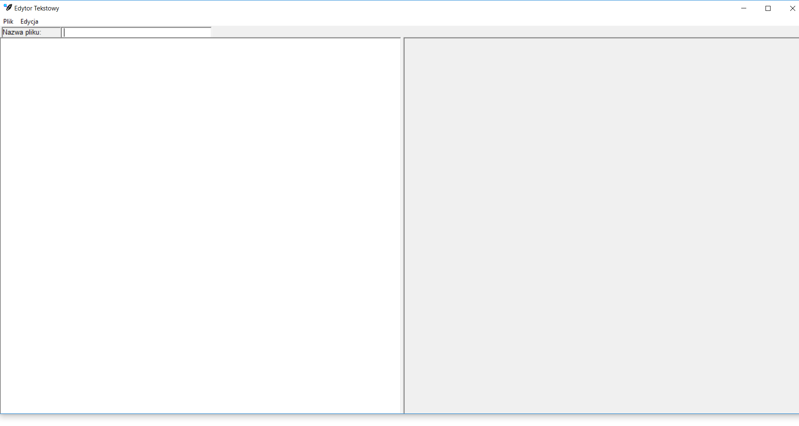

# masm32-TextEditor

My first small graphic application wrote in Assembly (masm32) language. I have written this to learn the basics of a low-level language, 
not only writing, but also to understand how this type of languages works. I leave it here, maybe someone will need something like that.

It's simple text editor which can create a new txt file in given folder and also open existed file. 
If you want to create, a new file you need to write some txt in edit window, then move the mouse on plik -> zapisz. Remember to add a name to
file you create ("Nazwa pliku" window). If you want to open a file in "Nazwa pliku" write a file name and then move the mouse on plik -> otworz.

How it looks like ? 

On Left EDIT window where you can type text. On right STATIC window where you can load text from a file.

